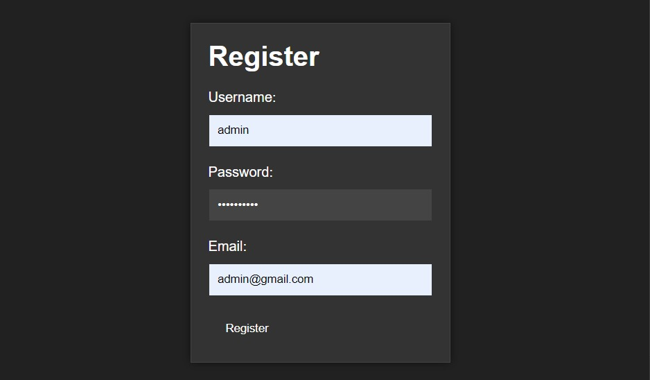
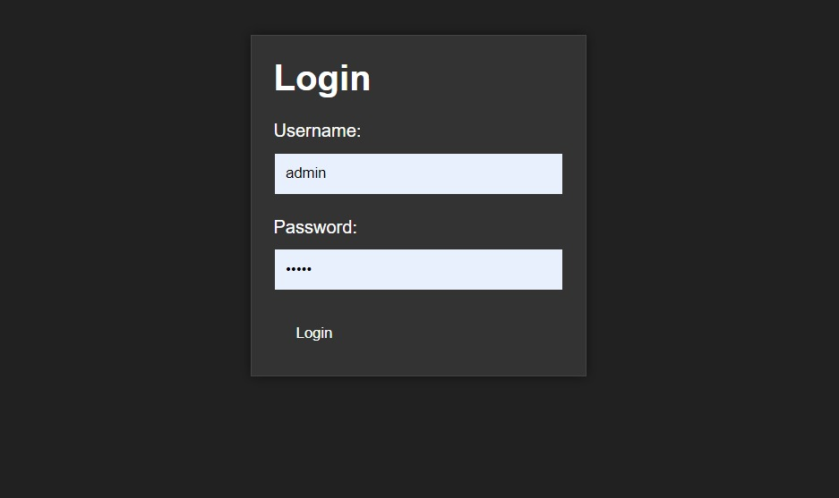

# FastAPI Authentication Example

## Descripción: 
Este proyecto es un ejemplo de autenticación utilizando FastAPI, un framework de Python para crear APIs rápidas y seguras. El proyecto incluye una implementación básica de autenticación con username y password, generación de tokens de acceso y refresh, y verificación de tokens de acceso y refresh. Además de una interfaz web con Jinja2, devolviendo plantillas html renderizadas.

## Características:

* Registro con username, password y correo

* Autenticación con username y password

* Generación de tokens de acceso y refresh
* Verificación de tokens de acceso y refresh
* Rutas para inicio de sesión, registro, perfil de usuario y obtener token de acceso
* Uso de SQLite como base de datos

## Índice

* [Instalación](#instalación)
* [Uso](#uso)
* [Características](#características)
* [Desarrollo](#desarrollo)
* [Licencia](#licencia)
* [Tecnologías](#tecnologías)

## Instalación

Para instalar el proyecto, sigue estos pasos:

1. Clona el repositorio con `git clone https://github.com/tu-usuario/fastapi-authentication-example.git`
2. Instala las dependencias con `pip install -r requirements.txt`
3. Configura la base de datos con `sqlite3 database.db`

## Uso

Para utilizar el proyecto, sigue estos pasos:

1. Inicia el servidor con `uvicorn main:app --port 8000`
2. Abre un navegador y ve a `http://127.0.0.1:8000/login` para iniciar sesión
3. Registra un nuevo usuario con `http://127.0.0.1:8000/register`
4. Obtén un token de acceso con `http://127.0.0.1:8000/token`
5. Utiliza el token de acceso para acceder a la ruta `/profile`

## Características

* Autenticación con username y password
* Generación de tokens de acceso y refresh
* Verificación de tokens de acceso y refresh
* Rutas para inicio de sesión, registro, perfil de usuario y obtener token de acceso
* Uso de SQLite como base de datos

## Desarrollo

Si deseas contribuir al proyecto, sigue estos pasos:

1. Clona el repositorio con `git clone https://github.com/Braian29/FastAPI-Authentication-Example`
2. Crea una rama nueva con `git branch mi-nueva-rama`
3. Realiza tus cambios y envíalos con `git push`

## Licencia

Este proyecto se distribuye bajo la licencia MIT.

## Tecnologías:

* FastAPI: Framework para crear APIs rápidas y seguras
* Python: Lenguaje de programación utilizado para desarrollar el proyecto
* SQLite: Base de datos relacional de código abierto utilizada para almacenar los datos de los usuarios
* Pydantic: Biblioteca para trabajar con datos en Python